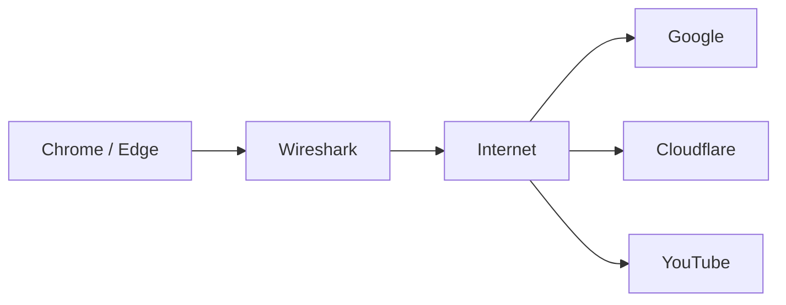
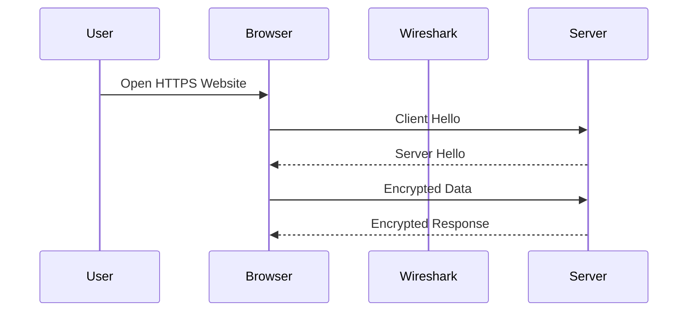

# LAB 01 - Analysis of Secure Networking Protocols (HTTP/3, QUIC, TLS 1.3) and DPI Limitations using Wireshark

# Wireshark

Analysis of Secure Networking Protocols (HTTP/3, QUIC, TLS 1.3) and DPI Limitations using Wireshark

# AIM

To capture and analyze real network traffic to identify TLS 1.3, QUIC, and HTTP/3, and to understand why Deep Packet Inspection (DPI) has limited visibility in modern encrypted protocols.

---


# Architecture Diagram



---

# Traffic Flow



---

# EXECUTION STEPS

## Part A - Capture TLS 1.3 Traffic

### Step 1

Open Wireshark.

---

### Step 2

Select the active network interface.

- Wi-Fi
- Ethernet

---

### Step 3

Start packet capture.

---

### Step 4

Visit one of the following websites.

```text
https://www.google.com

https://www.cloudflare.com

https://www.youtube.com
```

Browse several pages.

---

### Step 5

Apply the display filter.

```text
tls
```

---

### Step 6

Locate the following handshake packets.

- Client Hello
- Server Hello

Expand

```text
Transport Layer Security
```

Verify that TLS Version 1.3 is used.

---

### Step 7

Observe that the remaining packets are displayed as

```text
Encrypted Application Data
```

---

# Part B - Capture QUIC and HTTP/3

### Step 8

Remove the previous filter.

Continue packet capture.

---

### Step 9

Visit

```text
https://cloudflare-quic.com

https://www.youtube.com
```

---

### Step 10

Apply

```text
quic
```

If no packets appear, use

```text
udp.port == 443
```

---

### Step 11

Verify that packets are identified as QUIC.

---

### Step 12

Open Browser Developer Tools (F12).

Navigate to the Network tab.

Verify the protocol column displays

```text
h3
```

---

# Part C - Demonstrate DPI Limitations

### Step 13

Apply

```text
http
```

Observe visible URLs, headers, and payload.

---

### Step 14

Apply

```text
tls
```

Observe that only handshake information is visible.

---

### Step 15

Apply

```text
quic
```

or

```text
udp.port == 443
```

Observe that only metadata such as IP addresses, ports, and packet sizes are visible.

---

### Step 16

Stop packet capture.

Save the capture as

```text
Exp1_TLS_QUIC_HTTP3.pcapng
```

---

# Packet Capture Workflow


---

## OBSERVATIONS

- Selected Interface
- Filters Used
- TLS 1.3 Handshake Identified
- QUIC Packets Identified
- HTTP/3 Verified
- DPI Visibility Comparison

---

## SAMPLE SCREENSHOTS


# RESULT

Thus, network traffic was successfully captured and analyzed using Wireshark. TLS 1.3, QUIC, and HTTP/3 traffic were identified, and the limitations of Deep Packet Inspection (DPI) were demonstrated.
